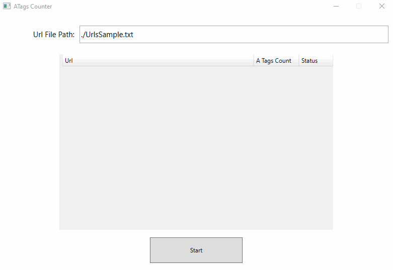

# Описание задачи.

Необходимо разработать клиентское приложение, которое:

1) Читает из файла список Url
2) Загружает соответствующие html страницы по Url
3) Находит на страницах все тэги **\<a>** и считает их количество
4) После завершения обработки выводит список прочитанных Url и количество тэгов **\<a>**

Обязательные требования:

+ Приложение должно быть написано на WPF
+ Приложение должно поддерживать запуск и отмену операции подсчёта количества тэгов
+ Приложение должно оставаться отзывчивым во время работы. 
+ Приложение должно каким-либо способом показывать пользователю о том,
что процесс выполняется
+ Приложение должно каким-либо образом визуально выделить тот Url,
по которому было насчитано наибольшее количество тэгов.

# Решение

